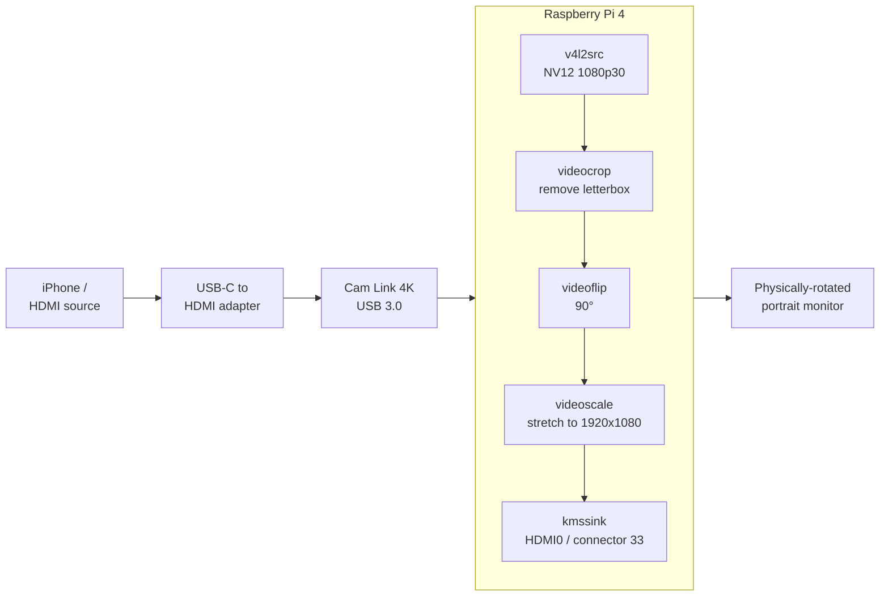

# rpi-hdmi-rotator

Headless HDMI video rotator for Raspberry Pi 4. Captures USB video (Elgato
Cam Link 4K, generic UVC capture sticks), rotates the signal in software,
and displays it fullscreen on a physically-rotated monitor via KMS/DRM.

## Why

iPhones (and most USB-C → HDMI adapters) cannot force the output orientation
when mirroring. If you shoot vertical video and want a large external
viewfinder in portrait, the HDMI signal arrives in landscape and looks wrong
on a rotated monitor. This tool intercepts the capture, crops the source
letterboxing, rotates, and stretches the signal so the physical rotation of
the monitor produces a correctly-oriented fullscreen image.

## How it works



The key insight: a landscape signal stretched to the monitor's native
resolution looks portrait and fullscreen when the monitor is physically
rotated 90°, because the stretch in signal space is undone by the physical
rotation in viewing space.

## Stack

| Layer | Tool |
|-------|------|
| OS | Raspberry Pi OS Lite 64-bit (Bookworm or Trixie) |
| Capture | v4l2src (UVC) |
| Processing | videocrop + videoflip + videoscale + videoconvert |
| Display | kmssink (DRM/KMS, no X11, no Wayland) |
| Service | systemd |

## Hardware tested

- Raspberry Pi 4 Model B (4GB)
- Elgato Cam Link 4K (USB 3.0)
- Samsung 1920x1080 monitor, physically rotated 90°
- iPhone source via USB-C → HDMI adapter

## Install

```bash
git clone https://github.com/sergioarojasm98/rpi-hdmi-rotator.git
cd rpi-hdmi-rotator
sudo ./install.sh
```

For a silent boot (no login prompt, no kernel messages):

```bash
sudo ./install.sh --silent-boot
```

After install:

1. Edit `/etc/rpi-hdmi-rotator/rotator.conf` to match your capture device
   and monitor rotation direction.
2. Run diagnostics: `/opt/rpi-hdmi-rotator/bin/diagnose.sh`
3. Start the service: `sudo systemctl start rpi-hdmi-rotator`
4. Verify it appears on boot: `sudo reboot`

## Configuration

The defaults target the iPhone + Cam Link 4K + physically-CW-rotated
Samsung 1080p monitor setup. Key parameters in `rotator.conf`:

| Parameter | Purpose |
|-----------|---------|
| `DEVICE` | V4L2 capture device (default `/dev/video0`) |
| `INPUT_WIDTH`/`HEIGHT`/`FRAMERATE` | Format negotiated with the capture |
| `CROP_LEFT`/`RIGHT`/`TOP`/`BOTTOM` | Remove source letterboxing |
| `ROTATION` | `clockwise`, `counterclockwise`, `rotate-180`, `none` |
| `CONNECTOR_ID` | DRM connector for the HDMI output |
| `OUTPUT_WIDTH`/`HEIGHT` | Signal resolution sent to the monitor |

Find your connector ID with:

```bash
sudo modetest -M vc4 -c
```

## Troubleshooting

Run the diagnostics helper:

```bash
/opt/rpi-hdmi-rotator/bin/diagnose.sh
```

Live logs:

```bash
journalctl -u rpi-hdmi-rotator -f
```

Test the pipeline manually:

```bash
sudo /opt/rpi-hdmi-rotator/bin/rotator.sh
```

## Limitations

- Source is assumed to letterbox portrait content. For full-frame sources
  set all `CROP_*` to `0`.
- Resolutions above 1080p30 have not been tested (bandwidth and CPU
  headroom are fine on Pi4 for 1080p60 NV12 but not validated end-to-end).
- Only single-tunnel single-monitor setups are supported.

## License

MIT
